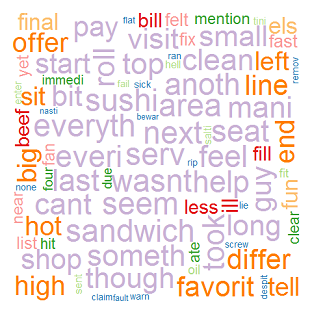
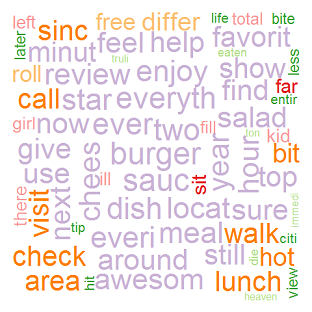
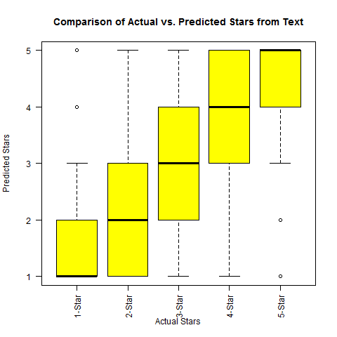

Yelp Project: Predicting Stars from Text
========================================================
author: 
date: 

Introduction
========================================================
left: 30%

The purpose of this project is to answer the following question:

- Can the number of stars in a Yelp review be predicted from the text alone?

***
Initial exploration shows clear differences in most frequent word stems between 1-star and 5-star ratings (1-star on left, 5-star on right):

 
 

Methods
========================================================
- Treat as a Classification Problem
 + Response variable = number of stars
 + Text reviews stemmed and converted into document-term matrix with TF/IDF weighting
- Model Stack for Classification
 + Component classifiers used were gradient boosting, quadratic discriminant analysis, and random forest
 + Stacking classifer used was random forest
- Used Random Sample of 25,000 Reviews 
 + Balanced to include 5000 of each star category
 + 60% used for training, 40% for testing

Results
========================================================
Prediction performance at a glance using test data:

 

Discussion
========================================================
- For each star level, majority of predictions were correct
- Deviations between actual and predicted were within +/- 1 star in majority of cases
- Lowest error rates in predicting 1-star and 5-star reviews
- Conclusion: Stars can be predicted with reasonable amounts of accuracy from text
